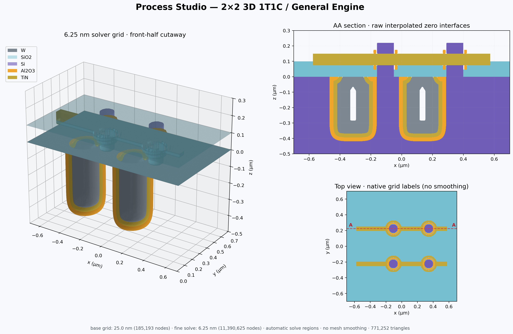

# Process Studio

面向实验室 3D integration 工艺推演的单用户桌面原型。它把版图或快速草图、工艺 Recipe、材料选择性、逐步快照和三维结构放在同一工程中，适合比较工艺分支、讨论器件结构和保存迭代过程。



> 当前版本是几何与流程可视化工具，不是经过晶圆厂数据标定的 TCAD/设备仿真器。

命令行 `process-studio` 能在终端里建工程、改步骤、运行和导出视图，见 [docs/CLI.md](docs/CLI.md)。
## 一分钟启动

桌面应用是 Tauri + React 外壳，工艺内核跑在一个 Python worker 进程里。开发运行：

```bash
python -m pip install -e ".[render]"
cd desktop
npm install
npm run tauri dev
```

不想装开发环境就直接用打包产物，见下一节。工程数据保存在工作目录下的 SQLite 文件及快照目录中，不需要安装或维护 SQL 服务。

新建工作区时要选一个仿真内核：自带的 **Level set**（均匀网格上的符号距离场）或并入的 **Slab (DeviceFlow)**（ProcessFlow-Emulator 使用的精确板层内核）。内核在新建时确定，之后不能更改——两者的几何表示不同，快照互不可读。两者的能力对照和选择依据见[内核说明](docs/KERNELS.md)。

前端只负责界面，不做任何数值计算。三列布局是流程、视口、参数：视口有 3D 表面、任意位置截面和俯视图；顶栏可以改网格、导入 GDS、编辑材料与 Recipe 库。每一步的结果按摘要缓存，改哪一步就只重算那一步之后的部分。协议、缓存规则和打包见[桌面前端说明](docs/DESKTOP_SHELL.md)。

工程窗口（x、y、z 范围，µm）和网格都在顶栏的间距按钮里改：窗口的 z 范围要跨过 0，0 以下是衬底，0 以上留给流程堆上去的东西，堆得厚就把 z max 调高。level set 工程的网格：填目标间距（nm）或选 Draft 25 nm、Standard 12.5 nm、Accurate 6.25 nm 预设，worker 会找出能整除三个方向跨度的最近格子，并实时给出节点数、状态体积和运行所需内存，超过 2000 万节点会拒绝。改网格会丢弃全部已存结果，流程从裸片按新网格重放，不插值旧结果。slab 工程同一个按钮改的是两个几何分辨率：z 步长（保形沉积沿高度的采样步长，也就是圆角肩部台阶的高度）和 XY 弧线弦高（平面内圆角的折线逼近偏差，决定每层轮廓的顶点数，留空跟随 z）。两者独立，z 调细只增加板层数，XY 调细只增加每层顶点数。没有节点数和内存估计，因为它不用场。

### 桌面安装产物

发布版本就是 Tauri 外壳，只提供应用本身，不做安装包和 DMG。`Desktop builds` GitHub Actions 在推送 `v*` tag 或手动触发时构建，产出：

| 产物 | 内容 |
| --- | --- |
| `ProcessStudio-Windows` | `ProcessStudio.exe` 与同级的 `resources/`，两个内核都有 |
| `ProcessStudio-macOS` | `Process Studio.app` 的压缩包和 DMG，两个内核都有 |
| `ProcessStudio-Slab-Windows` / `-macOS` | 只带 slab 内核的 `Process Studio Slab` |
| `ProcessStudio-LevelSet-Windows` / `-macOS` | 只带 level set 内核的 `Process Studio Level Set` |

单内核版新建工作区时没有内核选择，打开用另一个内核建的工程会被拒绝并提示去对应版本打开。三个版本产品名不同，可以并存。

Windows 产物必须整个目录一起用：exe 会在自己同级的 `resources/worker` 下找 worker，单独拷出 exe 无法运行。

**worker 被杀毒软件删掉了怎么办**：解压后报 `The packaged process worker was not found`，几乎都是 Defender 或公司的终端防护把 PyInstaller 打的 `process-studio-worker.exe` 隔离了。要么到保护历史记录里恢复并把目录加入排除项，要么不用打包的 worker，改装 Python 包（需要 Python 3.11 以上）：

```powershell
py -m pip install "process-studio[render] @ git+https://github.com/lisiyuan2005/process-studio@v0.8.1"
```

之后照常双击 `ProcessStudio.exe`：找不到打包的 worker 时它会自动用 pip 装出来的 `process-studio-worker`（在 PATH 或 Python 的 Scripts 目录里找；也可以用环境变量 `PROCESS_STUDIO_WORKER` 指定路径）。这个 worker 是普通的 Python 启动器，杀毒软件不会动它，代码和打包版完全一样。

本地构建：

```powershell
./scripts/build_desktop.ps1     # Windows
```

```bash
./scripts/build_desktop.sh      # macOS / Linux
```

脚本先用 PyInstaller 把 worker 打成独立可执行文件，跑一次 `describe` 冒烟测试，再执行 `npm run tauri build`。本机需要 Python 3.11 以上、Node 20 以上、Rust 工具链（Windows 还要 Visual Studio Build Tools 的 C++ 组件和 WebView2）；脚本会自己建虚拟环境装 Python 依赖。

macOS 产物用 ad-hoc 身份签名（`signingIdentity: "-"`），没有 Developer ID 也没有 notarize。构建固定在 `macos-14` 运行器上，并在打包前校验 bundle 已封存资源，否则构建失败。

首次打开会提示「Apple 无法验证此 App」。macOS 15 起右键**打开**不再绕过这一步，要到**系统设置 → 隐私与安全性**，在安全性一段点**仍要打开**。或者直接清掉隔离标记：

```bash
xattr -dr com.apple.quarantine "/Applications/Process Studio.app"
```

若提示的是「应用已损坏」而不是「无法验证」，那是 bundle 签名本身有问题，不是公证问题。要彻底免掉这一步，需要付费的 Developer ID 签名并 notarize。

## 已实现的 MVP

- 两个可选仿真内核：Level set（网格上的符号距离场）与 Slab（并入的 DeviceFlow 0.2.0 精确板层内核），新建工程时选定且不可更改
- 多材料 3D 状态、确定性的材料覆盖优先级与独立显示/隐藏
- 流程驱动的细化执行 API：可证明数值影响范围时局部重算；全局依赖时统一细网格重算；不是动态 AMR
- Level Set 干法刻蚀、方向性/各向同性混合刻蚀、简化湿法刻蚀
- 可选二阶 HJ + SSP-RK2，同层分块每个时间子步同步边界；[配置和验证](docs/SYNCHRONIZED_SOLVER.md)
- 顶栏的网格按钮可选 25/12.5/6.25 nm 预设或自定义网格间距，并改工程窗口；应用前显示节点数和内存估计，换精度会清除已存结果并要求重新运行
- 等厚保形沉积、方向性图形沉积/填充、理想平面 CMP
- Step 自带工艺类型和参数；Recipe Library 只用于加载模板或保存可复用模板
- 可按时间运行，也可直接输入目标厚度或目标深度
- 每个项目一个 GDS；步骤选择 layer/datatype、保留图形内或图形外
- 未选择 mask 时默认整片暴露
- Quick Sketch：矩形、圆、多边形、路径，merge/subtract/intersect 和参数化阵列
- Process Flow：增删、复制、移动、跳过步骤（右键菜单），运行到选中步骤、运行全部、中途停止；分支在数据模型和 worker 里已有，界面暂未提供创建入口
- 每步自动保存快照；删除某一步时同步删除该步及下游无引用快照
- 3D 旋转/缩放、材料显隐、Top View、任意画线 AA–BB 截面、截面与俯视图上的距离测量、坐标读数和比例尺
- Material Library、Process/Recipe Library、简化 Excel 导入导出
- 底部 Process Log 记录每步耗时和错误信息
- 嵌入式 SQLite 持久化；无需数据库服务器
- Tauri + React 外壳：三列布局、拖拽排序、按摘要缓存的增量执行、three.js 表面视图

## 界面工作流

1. 在左侧 Process Flow 添加或选择步骤。
2. 在右侧选择工艺类型；可加载已有 Recipe，也可只添加当前工艺需要的参数并另存为新 Recipe。
3. 若不用 GDS，把掩膜来源选成 Quick Sketch，点 **Edit** 或 **New** 打开编辑器，在工程窗口上画矩形、圆、多边形或路径，右侧列表里改精确尺寸、布尔操作和阵列参数；填充显示的是内核实际会采样的曝光区域。
4. 点击右侧的 **Run to here** 检查单步结果，或点击顶栏的 **Run** 计算整个流程。运行中顶栏按钮变成 **Stop**，点它在当前步骤算完后停下，已完成的步骤保留，下次运行从那里续。
5. 在中间切换 3D、Top View 和 AA–BB Section；点 3D 页底栏的材料图例可以隐藏或显示该材料，用来检查内部结构。
   改过参数但还没重新运行的步骤仍然显示上次运行存下的结果，视口上会标注它已过期；从未运行过的步骤则提示先运行。
   流程列表里每张卡片右侧的方框控制这一步是否参与运行，勾掉即跳过，该步及其之后需要重新运行。
6. 需要比较方案时，右键步骤 **Duplicate** 复制一份改参数，或用命令行 `flow dump` 把流程存成文件再改；已存结果按位置复用，只重算变化后的步骤。

## Recipe Excel 格式

模板位于 `examples/recipe-template.xlsx`。一行表示一个 Recipe 对一种材料的响应；同名 Recipe 的多行会合并，因此无需维护复杂的层级表格。

| 字段 | 用途 |
| --- | --- |
| Process Name / Recipe | 工艺与 Recipe 名称 |
| Type | `deposit`、`etch`、`cmp` 或 `no_geometry` |
| Tool | 设备名称 |
| Material | 沉积材料或被刻蚀材料 |
| Time / Temperature | 可选工艺条件 |
| Target Thickness/Depth | 可替代时间直接指定几何目标 |
| Directional Fraction | 0 为各向同性，1 为完全方向性 |
| Rate | 对该材料的沉积/刻蚀速率 |
| Stop Layer | 是否作为停止层 |
| Extra Parameters JSON | 少量不常用扩展字段 |

例如 BOE 可以只填 `time=1 min`、`temperature=25 °C`，并在不同材料行记录 SiO2 速率与 Si stop layer。

## 2×2 3D 1T1C 示例

重新生成示例：

```powershell
$env:PYTHONPATH='src'
python examples\build_1t1c_demo.py --output-dir ..\process-studio-1t1c-demo
```

示例包含 12 个步骤：涂胶、显影、电容沟槽刻蚀、去胶、Al2O3/TiN 保形沉积、W 填充、CMP、层间介质、垂直沟道、栅介质和 TiN 字线。沟槽刻蚀不用草图掩膜，而是靠图形化的光刻胶挡住刻蚀，掩膜边缘因此是一层真实固体。输出中包含可直接打开的工程数据库、每步快照、Quick Sketch、最终材料状态、日志、Excel Recipe 模板和总览图。脚本会连同每步的摘要一起写入，因此在桌面端打开时全部步骤都是 Ready，可以直接逐步查看，不需要再跑一遍。

使用已保存状态的网格定义，从初始衬底重新执行 4× 细化（不会插值旧的最终结果）：

```powershell
python -m pip install -e ".[render]"
python examples\render_1t1c_adaptive.py `
  ..\process-studio-1t1c-demo\final-state.npz `
  --adaptive-dir ..\process-studio-1t1c-demo\general-engine-state `
  --output docs\assets\1t1c-general-engine.png `
  --factor 4
```

该示例的基础网格间距为 25 nm。由于保形沉积需要全局距离重建，流程规划器自动选择全域 6.25 nm 网格，共 11,390,625 个节点，重新执行全部 9 步。没有按单元分块、圆心对齐或固定 halo。新执行 API 见 [通用引擎说明](docs/GENERAL_ENGINE.md)。桌面原有 Run 按钮仍使用项目网格；细化规划目前由 API/示例脚本调用。

截面从材料零界面线性插值采样，3D 网格使用原始零等值面，不删除碎片、不补洞、不移动顶点。Top View 仍是原生网格标签；细化显示或提高图片 DPI 不等于提高计算精度。旧快照、旧图片和旧 EXE 不会自动升级。

同一 6.25 nm 二阶流程的十二步中间结构见 [1T1C 逐步结果](docs/1T1C_STEPS.md)。这些图片由每一步保存的数值状态生成，不是从最终结构倒推。

## 验证

```bash
python -m pytest -q
cd desktop && npm run test
```

数值验证覆盖平面前沿、圆形沉积/刻蚀、Level Set 重初始化、3D 沟槽、干/湿混合刻蚀、保形膜厚与 pinch-off、多材料优先级、选择性刻蚀、CMP、Quick Sketch、GDS、Excel、SQLite 分支与快照以及完整 Process Engine。

## 当前边界

- 两个内核能表达的工艺不同：slab 内核只做垂直或各向同性刻蚀、保形或平面沉积（可带掩膜，按 lift-off 处理）、不区分材料的 CMP，做不到的会直接报错而不是近似。
- 湿法刻蚀目前是各向同性近似，不含晶向与晶面速率。
- CMP 是理想平面截断，不含 dishing、erosion、pattern-density 或 pad/slurry 模型。
- GDS/Quick Sketch 均提供连续边界，再采样到笛卡尔网格；CSG 场保持零界面但并非处处严格距离。薄膜/小孔仍需多个计算单元解析并做收敛验证。
- 当前没有动态稀疏 AMR/跨层 ghost-cell 同步；含全局依赖的流程退回全域细化，超出节点预算则报错，绝不静默降低精度。
- 方向性通量沿垂直方向，不含角分布、shadowing、microloading、mask erosion 或 sidewall passivation。
- 多材料选择性刻蚀采用逐材料 Level Set 响应，适合流程可视化；复杂界面反应仍需后续物理模型。
- 当前是单机单用户桌面原型；按需求未加入多人协作、工艺报告和演化动画。

设计与数据结构见 `docs/DESIGN.md`，验证范围见 `docs/VALIDATION.md`。

## 许可

[MIT](LICENSE)。`src/deviceflow/` 是作者自己的 DeviceFlow 内核，随本仓库一并以 MIT 发布。
