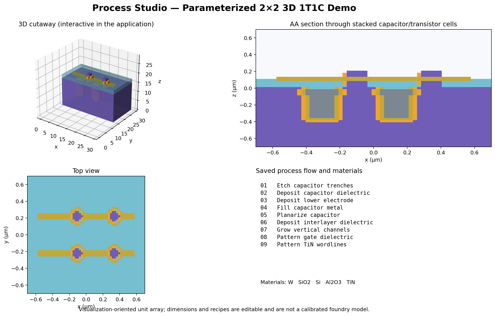

# Process Studio

面向实验室 3D integration 工艺推演的单用户桌面原型。它把版图或快速草图、工艺 Recipe、材料选择性、逐步快照和三维结构放在同一工程中，适合比较工艺分支、讨论器件结构和保存迭代过程。



> 当前版本是几何与流程可视化工具，不是经过晶圆厂数据标定的 TCAD/设备仿真器。

## 一分钟启动

Windows 下双击 `启动 Process Studio.bat`。首次启动若缺少 Python 依赖，启动器会自动安装本项目及依赖。也可以在 PowerShell 中运行：

```powershell
python -m pip install -e .
process-studio
```

打开已经计算好的 2×2 1T1C 示例，可双击 `打开 1T1C 示例.bat`。工程数据保存在工作目录下的 SQLite 文件及快照目录中，不需要安装或维护 SQL 服务。

### 桌面安装产物

无需 Python 的 Windows 版本可直接运行 `ProcessStudio.exe`。本地重新构建：

```powershell
./scripts/build_windows.ps1
```

macOS `.app` 必须在 macOS 上构建，仓库中的 `Desktop builds` GitHub Actions 会在推送 `v*` tag 或手动触发时同时生成 Windows EXE 和 `ProcessStudio.app` 压缩包。macOS 产物当前未签名或 notarize，首次打开可能需要在 Finder 中右键选择 **Open**。

## 已实现的 MVP

- 多材料 3D 状态、确定性的材料覆盖优先级与独立显示/隐藏
- Level Set 干法刻蚀、方向性/各向同性混合刻蚀、简化湿法刻蚀
- 等厚保形沉积、方向性图形沉积/填充、理想平面 CMP
- Recipe 中定义材料速率、选择比和 stop layer；步骤可覆盖 Recipe 字段
- 可按时间运行，也可直接输入目标厚度或目标深度
- 每个项目一个 GDS；步骤选择 layer/datatype、保留图形内或图形外
- 未选择 mask 时默认整片暴露
- Quick Sketch：矩形、圆、多边形、路径，merge/subtract/intersect 和参数化阵列
- Process Flow：增删步骤、运行到选中步骤、运行全部、从当前步骤创建分支
- 每步自动保存快照；删除某一步时同步删除该步及下游无引用快照
- 3D 旋转/缩放、材料显隐、Top View、任意画线 AA–BB 截面
- Material Library、Process/Recipe Library、简化 Excel 导入导出
- 底部 Process Log 记录每步耗时和错误信息
- 嵌入式 SQLite 持久化；无需数据库服务器

## 界面工作流

1. 在左侧 Process Flow 添加或选择步骤。
2. 在右侧选择 Recipe，并按需要覆盖材料、厚度/深度、时间、温度、mask、GDS layer/datatype 等字段。
3. 若不用 GDS，在 Top View 直接画矩形、圆、多边形或路径；也可以编辑 JSON 设置精确尺寸与阵列参数。
4. 点击 **Run to Selected** 检查单步结果，或点击 **Run All** 计算整个流程。
5. 在中间切换 3D、Top View 和 AA–BB Section；在 3D 页隐藏材料以检查内部结构。
6. 需要比较方案时，在共同步骤上点击 **Branch Here**。新分支复用已有快照，只重新计算变化后的步骤。

## Recipe Excel 格式

模板位于 `examples/recipe-template.xlsx`。一行表示一个 Recipe 对一种材料的响应；同名 Recipe 的多行会合并，因此无需维护复杂的层级表格。

| 字段 | 用途 |
| --- | --- |
| Process Name / Recipe | 工艺与 Recipe 名称 |
| Type | `deposit`、`etch`、`cmp` 或 `no_geometry` |
| Tool | 设备名称 |
| Material | 沉积材料或被刻蚀材料 |
| Time / Temperature | 可选工艺条件 |
| Target Thickness/Depth | 可替代时间直接指定几何目标 |
| Directional Fraction | 0 为各向同性，1 为完全方向性 |
| Rate | 对该材料的沉积/刻蚀速率 |
| Stop Layer | 是否作为停止层 |
| Extra Parameters JSON | 少量不常用扩展字段 |

例如 BOE 可以只填 `time=1 min`、`temperature=25 °C`，并在不同材料行记录 SiO2 速率与 Si stop layer。

## 2×2 3D 1T1C 示例

重新生成示例：

```powershell
$env:PYTHONPATH='src'
python examples\build_1t1c_demo.py --output-dir ..\process-studio-1t1c-demo
```

示例包含 9 个步骤：电容沟槽刻蚀、Al2O3/TiN 保形沉积、W 填充、CMP、层间介质、垂直沟道、栅介质和 TiN 字线。输出中包含可直接打开的工程数据库、9 个步骤快照、Quick Sketch、最终材料状态、日志、Excel Recipe 模板和总览图。

## 验证

```powershell
python -m pytest -q
python -m process_studio --smoke-test --workspace work\ui-smoke
```

数值验证覆盖平面前沿、圆形沉积/刻蚀、Level Set 重初始化、3D 沟槽、干/湿混合刻蚀、保形膜厚与 pinch-off、多材料优先级、选择性刻蚀、CMP、Quick Sketch、GDS、Excel、SQLite 分支与快照以及完整 Process Engine。

## 当前边界

- 湿法刻蚀目前是各向同性近似，不含晶向与晶面速率。
- CMP 是理想平面截断，不含 dishing、erosion、pattern-density 或 pad/slurry 模型。
- GDS 会栅格化到均匀笛卡尔网格；最小特征应至少覆盖 3–5 个网格单元。
- 方向性通量沿垂直方向，不含角分布、shadowing、microloading、mask erosion 或 sidewall passivation。
- 多材料选择性刻蚀采用逐材料 Level Set 响应，适合流程可视化；复杂界面反应仍需后续物理模型。
- 当前是单机单用户桌面原型；按需求未加入多人协作、工艺报告和演化动画。

设计与数据结构见 `docs/DESIGN.md`，验证范围见 `docs/VALIDATION.md`。
