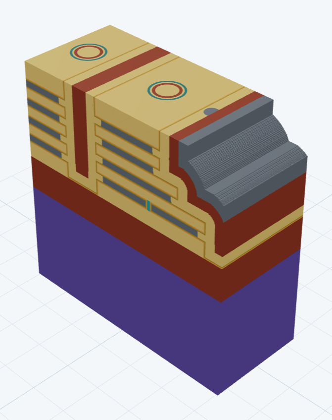
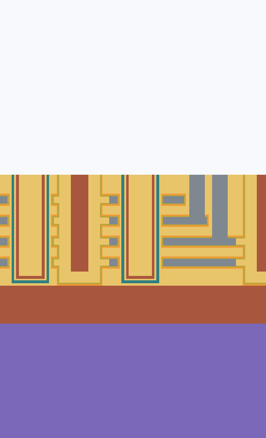

# Process Studio

面向实验室 3D integration 工艺推演的单用户桌面原型。它把版图或快速草图、工艺 Recipe、材料选择性、逐步快照和三维结构放在同一工程中，适合比较工艺分支、讨论器件结构和保存迭代过程。



> 当前版本是几何与流程可视化工具，不是经过晶圆厂数据标定的 TCAD/设备仿真器。

命令行 `process-studio` 能在终端里建工程、改步骤、运行和导出视图，见 [docs/CLI.md](docs/CLI.md)。

## 一分钟启动

桌面应用是 Tauri + React 外壳，工艺内核跑在一个 Python worker 进程里。开发运行：

```bash
python -m pip install -e .
cd desktop
npm install
npm run tauri dev
```

不想装开发环境就直接用打包产物，见下一节。工程数据保存在工作目录下的 SQLite 文件及快照目录中，不需要安装或维护 SQL 服务。材料、工具和 Recipe 不跟着工程走，而是一台机器（一个用户）一个共享库。

只有一个仿真内核：并入的 **Slab (DeviceFlow)**，几何是精确的多边形板层堆叠，没有网格。原来自带的 level set 内核在 `0.9.8` 之后删掉了，代码留在 `archive/levelset` 分支；用它建的老工程打开时会被明确拒绝并说明去哪个版本打开。内核能做什么、做不到什么会怎么报错，见[内核说明](docs/KERNELS.md)。

前端只负责界面，不做任何数值计算。三列布局是流程、视口、参数：视口有 3D 表面、任意位置截面和俯视图；顶栏可以改窗口和分辨率、导入 GDS、编辑材料与 Recipe 库、在某一步分叉出新流程。每一步的结果按摘要缓存，改哪一步就只重算那一步之后的部分。协议、缓存规则和打包见[桌面前端说明](docs/DESKTOP_SHELL.md)。

顶栏的间距按钮里有两组数，含义完全不同：

- **工程窗口**（x、y、z 范围，µm）：z 范围要跨过 0，0 以下是衬底，0 以上留给流程堆上去的东西，堆得厚就把 z max 调高。**衬底厚度就是窗口的深度**，对话框里有一个 Substrate thickness 字段直接填（填 200 nm 就是 z min = −0.2）。
- **几何分辨率**：z 步长（保形沉积和各向同性刻蚀沿高度的采样步长，也就是圆角肩部台阶的高度）和 XY 弧线弦高（平面内圆角折线逼近的偏差，决定每层轮廓的顶点数，留空跟随 z）。两者独立。**垂直刻蚀、平面沉积和 CMP 与它们无关**，任何分辨率下逐位相同；调了却看不出变化是正常的，变的只有圆角、斜面和各向同性前沿。没有节点数和内存估计，因为这个内核不用场。

改窗口或改分辨率都会丢弃全部已存结果，流程从裸片重放。

膜模型（fidelity）有两档，默认**简化版**：简化版的膜是直角、每个平面一段，快得多；细节版是圆角、沿高度按分辨率采样。两档的结果分开保存，切回去不用重算。

### 桌面安装产物

发布版本就是 Tauri 外壳，只提供应用本身，不做安装程序。`Desktop builds` GitHub Actions 在推送 `v*` tag 或手动触发时构建，产出：

| 产物 | 内容 |
| --- | --- |
| `ProcessStudio-Windows.zip` | `ProcessStudio.exe` 与同级的 `resources/` |
| `ProcessStudio-macOS.zip` | `Process Studio.app`（同时出一个 DMG） |

Windows 产物必须整个目录一起用：exe 会在自己同级的 `resources/worker` 下找 worker，单独拷出 exe 无法运行。

**版本号从 `0.9.8` 重置成 `0.1.0`**：只剩一个内核、一个版本，从这里重新数。应用里的「检查更新」按"最新 release 和当前构建不一样"判断，不是按"更大"，所以 `0.9.8` 的用户照样会被告知 `0.1.0` 可装。

macOS 首次打开会提示「Apple 无法验证此 App」（产物是 ad-hoc 签名，没有 Developer ID，也没有 notarize）。macOS 15 起右键**打开**不再绕过这一步，要到**系统设置 → 隐私与安全性**，在安全性一段点**仍要打开**。或者直接清掉隔离标记：

```bash
xattr -dr com.apple.quarantine "/Applications/Process Studio.app"
```

若提示的是「应用已损坏」而不是「无法验证」，那是 bundle 签名本身有问题，不是公证问题。

**`v0.9.0` 起 Windows 包不再用 PyInstaller**，改用官方的 embeddable Python 加普通 PyPI wheel（`python.exe` 是签名的官方解释器，装进去的包都是正式发行的 wheel），不再是杀毒软件常见的误报对象。如果仍然遇到 `The packaged process worker was not found`：到保护历史记录里恢复并把目录加入排除项，或者不用打包的 worker，改装 Python 包（需要 Python 3.11 以上）：

```powershell
py -m pip install "process-studio @ git+https://github.com/lisiyuan2005/process-studio@main"
```

之后照常双击 `ProcessStudio.exe`：找不到打包的 worker 时它会自动用 pip 装出来的 `process-studio-worker`（在 PATH 或 Python 的 Scripts 目录里找；也可以用环境变量 `PROCESS_STUDIO_WORKER` 指定路径）。

本地构建：

```powershell
./scripts/build_desktop.ps1     # Windows
```

```bash
./scripts/build_desktop.sh      # macOS / Linux
```

macOS/Linux 脚本先用 PyInstaller 把 worker 打成独立可执行文件；Windows 脚本改成下载官方的 embeddable Python，装上 pip 后把包装进去，不用 PyInstaller，也不需要本机先装 Python。两条路径都会跑一次 `describe` 冒烟测试，再执行 `npm run tauri build`。本机需要 Node 20 以上、Rust 工具链（Windows 还要 Visual Studio Build Tools 的 C++ 组件和 WebView2）；macOS/Linux 还需要 Python 3.11 以上（脚本会自己建虚拟环境装依赖）。详见[打包说明](docs/DESKTOP_SHELL.md#打包)。

## 已实现

- 精确多边形板层内核（并入的 DeviceFlow 0.2.0），两档膜模型（简化 / 细节），做不到的工艺直接报错而不是近似
- 多材料 3D 状态、确定性的材料覆盖优先级与独立显示/隐藏
- 等厚保形沉积、从上方落下的平面沉积（侧壁也长膜）、带掩膜的沉积（理想 lift-off）
- 垂直刻蚀与各向同性（湿法）刻蚀，湿法前沿认屏障：封闭空腔不是刻蚀源，开壳之后才刻得到
- 氧化：露出表面向内一层原地变成氧化物，按各材料速率比例消耗，不模拟体积膨胀
- 理想平面 CMP（对所有材料一视同仁）
- Step 自带工艺类型和参数；Recipe Library 只用于加载模板或保存可复用模板，加载即复制、不留引用
- 参数可以按自己习惯的单位输入（nm/µm、s/min/h、nm/s 等），存下来的永远是内核读的那个单位，换单位不会让步骤过期
- ALD/ALE 工具的沉积按 **Cycles × Rate per cycle** 写（fab 里的写法），下面实时显示乘出来的膜厚；厚度也可以直接给，或按时间×速率给
- 每一步（和每条 Recipe）有两套参数：**Simulation**（内核读的，要建出什么）和 **Experiment**（机器实际设成什么：时间、功率、装的哪条 tool recipe）。默认两套相同，分开时先复制一份；内核不读 experiment，摘要也不含它，**补记机台设置不会让已算好的结果过期**
- 导出流程为 Excel/CSV 时可以选要哪些列（另有 Run sheet、Review 预设），并选导出哪一套参数
- 可按时间运行，也可直接输入目标厚度或目标深度
- 每个项目一个 GDS；步骤选择 layer/datatype、保留图形内或图形外；未选择 mask 时默认整片暴露
- Quick Sketch：矩形、圆、多边形、路径，merge/subtract/intersect 和参数化阵列
- Process Flow：增删、复制、移动、跳过步骤，多选与批量操作，循环块（一段步骤重复 N 次），运行到选中步骤、运行全部、中途停止（在当前步骤内部就停）
- **工艺分叉**：在某一步之后分出一条新分支，分叉点之前的步骤和已经算好的结果一起带过去；分支可改名、可删除（只删这条分支独有的结果）
- 每步自动保存快照；删除某一步或某条分支时同步删除无引用快照
- 3D 旋转/缩放、材料显隐与临时配色、按阵列平铺单元胞、Top View（可看穿指定材料、同一材料的高度分界画台阶线）、任意画线 AA–BB 截面（可保存多条）、截面与俯视图上的距离测量、坐标读数和比例尺；切换步骤时保持视角和缩放
- 材料、工具、Recipe 是一台机器共用一个库，简化 Excel 导入导出
- 底部 Process Log 记录每步耗时和错误信息
- 嵌入式 SQLite 持久化；无需数据库服务器；工作目录里不存绝对路径，压成 zip 发给别人也能打开
- 顶栏的命令控制台：把命令或整个流程文件粘进去就在当前工作目录里执行，界面跟着更新

## 界面工作流

1. 在左侧 Process Flow 添加或选择步骤。
2. 在右侧选择工艺类型；可加载已有 Recipe，也可只添加当前工艺需要的参数并另存为新 Recipe。
3. 若不用 GDS，把掩膜来源选成 Quick Sketch，点 **Edit** 或 **New** 打开编辑器，在工程窗口上画矩形、圆、多边形或路径，右侧列表里改精确尺寸、布尔操作和阵列参数；填充显示的是内核实际会采样的曝光区域。
4. 点击右侧的 **Run to here** 检查单步结果，或点击顶栏的 **Run** 计算整个流程。运行中顶栏按钮变成 **Stop**，点它在当前步骤内部就停下，已完成的步骤保留，下次运行从那里续。
5. 在中间切换 3D、Top View 和 AA–BB Section；点 3D 页底栏的材料图例可以隐藏或显示该材料，用来检查内部结构；俯视图的图例也是开关，隐藏一种材料就重画一张，看它盖住的图形和台阶。
   改过参数但还没重新运行的步骤仍然显示上次运行存下的结果，视口上会标注它已过期；从未运行过的步骤则提示先运行。
   流程列表里每张卡片右侧的方框控制这一步是否参与运行，勾掉即跳过，该步及其之后需要重新运行。
6. 需要比较方案时，用 **Branch → 从选中步分叉**分出一条新流程改参数（分叉点之前的结果照用），或右键步骤 **Duplicate** 复制一份，或用命令行 `flow dump` 把流程存成文件再改。

## Recipe Excel 格式

模板位于 `examples/recipe-template.xlsx`。一行表示一个 Recipe 对一种材料的响应；同名 Recipe 的多行会合并，因此无需维护复杂的层级表格。

| 字段 | 用途 |
| --- | --- |
| Process Name / Recipe | 工艺与 Recipe 名称 |
| Type | `deposit`、`etch`、`cmp`、`oxidation` 或 `no_geometry` |
| Tool | 设备名称 |
| Material | 沉积材料或被刻蚀材料 |
| Time / Temperature | 可选工艺条件 |
| Target Thickness/Depth | 可替代时间直接指定几何目标 |
| Directional Fraction | 0 为各向同性，1 为完全方向性 |
| Rate | 对该材料的沉积/刻蚀速率 |
| Stop Layer | 是否作为停止层 |
| Group | Recipe Library 里的分组路径（斜杠分子组） |
| Extra Parameters JSON | 少量不常用扩展字段 |

例如 BOE 可以只填 `time=1 min`、`temperature=25 °C`，并在不同材料行记录 SiO2 速率与 Si stop layer。

## 3D NAND 示例

`examples/3d-nand/flow.json` 是一条完整的替代栅（gate-last）3D NAND 流程，34 步：4 对 ON 叠层、2 个沟道孔、两条 slit、2 级阶梯、存储膜、替代栅和字线接触。尺寸比量产器件粗几倍，块做得很窄，好让两步各向同性刻蚀很快算完。

```bash
process-studio --root nand flow apply examples/3d-nand/flow.json   # 建工作目录并写入流程
process-studio --root nand run                                     # 运行全部 34 步
process-studio --root nand view section --named 1 -o holes.png      # 过孔和 slit 的截面
process-studio --root nand view top -o top.png                     # 俯视图
```

之后把 `nand` 目录用桌面端打开，全部步骤都是 Ready，可以逐步查看。示例的说明见 [examples/3d-nand/README.md](examples/3d-nand/README.md)。

| 截面（过两个沟道孔和左边的 slit） | 俯视图（细线是同一材料自己的台阶） |
| --- | --- |
|  |  |

## 验证

```bash
python -m pytest -q          # 207 项
cd desktop && npm run test   # 77 项
```

覆盖范围见[验证清单](docs/VALIDATION.md)：膜厚与 undercut、湿法前沿的屏障、CMP 高度、掩膜沉积、氧化、状态存档往返、3D 显示网格、共享库、工艺分叉、摘要缓存、RPC 协议与命令行。这些测试验证的是离散几何行为和数据一致性，不是工艺精度。

## 当前边界

- 内核能表达的工艺是有限的：只做垂直或各向同性刻蚀、保形或平面沉积（可带掩膜，按 lift-off 处理）、不区分材料的 CMP、不膨胀的氧化；做不到的会直接报错而不是近似。
- 湿法刻蚀是各向同性近似，不含晶向与晶面速率。
- CMP 是理想平面截断，不含 dishing、erosion、pattern-density 或 pad/slurry 模型。
- 方向性刻蚀沿垂直方向，不含角分布、shadowing、microloading、mask erosion 或 sidewall passivation。
- 材料选择性是按材料给速率，适合流程可视化；复杂界面反应仍需后续物理模型。
- 衬底是一整块，还不能在背面做工艺（双面集成）。
- 当前是单机单用户桌面原型；按需求未加入多人协作、工艺报告和演化动画。

设计与数据结构见 [docs/DESIGN.md](docs/DESIGN.md)，验证范围见 [docs/VALIDATION.md](docs/VALIDATION.md)。

## 许可

[MIT](LICENSE)。`src/deviceflow/` 是作者自己的 DeviceFlow 内核，随本仓库一并以 MIT 发布。
