# 1T1C 十二步结构结果

这组图片从平坦 Si 衬底开始，按同一条流程连续计算一次，并在每一步结束后保存真实材料状态。全部结果使用 6.25 nm 三维均匀网格（225×225×225，11,390,625 个节点）、二阶界面推进；AA 截面固定在 y=0.225 µm，视角和坐标范围保持不变，便于逐步比较。

电容沟槽不再由钉在表面平面上的草图掩膜规则形成，而是由一层真实的光刻胶挡出来：涂胶、显影、隔着胶刻蚀、去胶。掩膜边缘因此是一层固体，刻蚀前沿必须绕过它的边缘。

> 这是用于工艺推导和软件验证的参数化 2×2 1T1C 几何模型，不是经过晶圆厂数据标定的 TCAD 模型。图片不做轮廓镜像、补洞或几何平滑，因而会保留当前内核的离散误差和异常空隙。

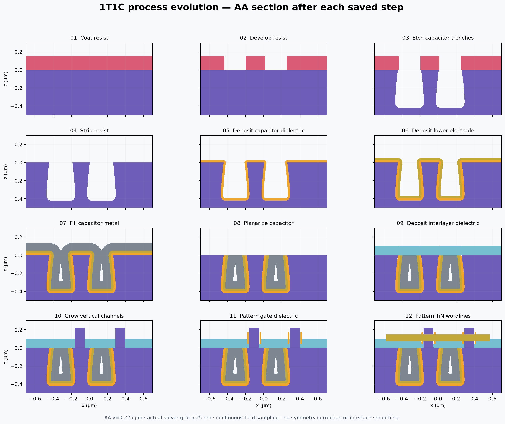

## 01 涂覆光刻胶

在整片衬底上保形沉积 150 nm 光刻胶。这一层是真实材料，不是一条掩膜规则。

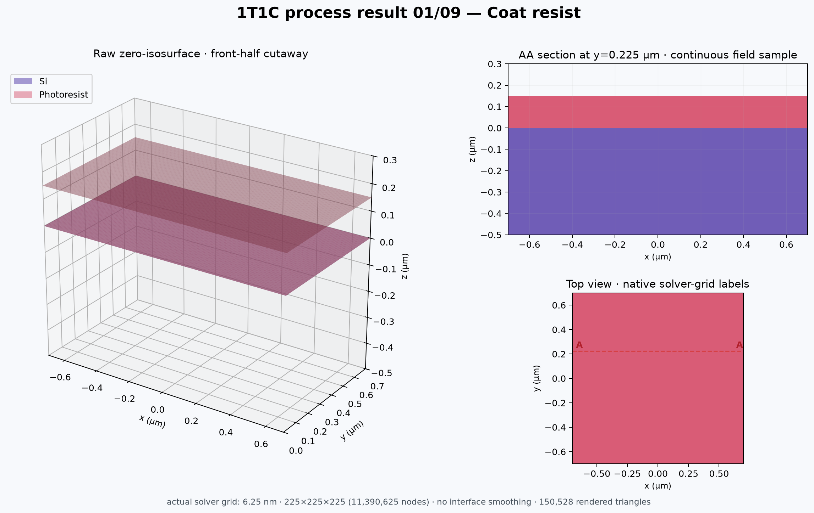

## 02 显影

用圆形 Quick Sketch 在胶层里刻出开口，Si 作为停止层。开口左右半宽实测 120.00 nm 对 120.00 nm。

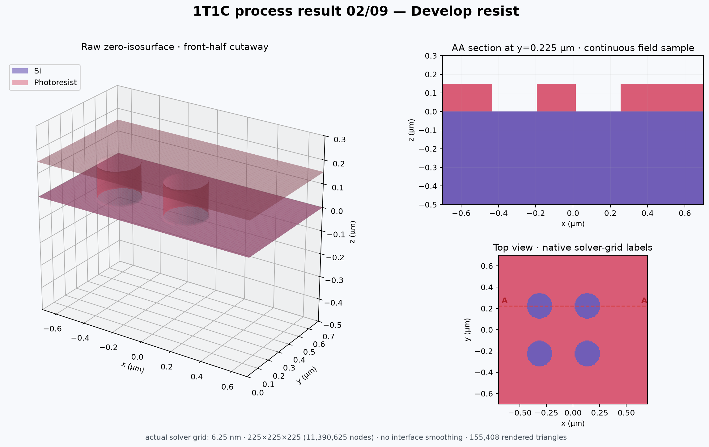

## 03 电容沟槽刻蚀

整片曝光，目标深度 0.42 µm，方向性比例 0.92，光刻胶速率为零。胶挡住它下面的硅，刻蚀只在开口里向下走，8% 的各向同性分量在胶檐下形成横向内凹。

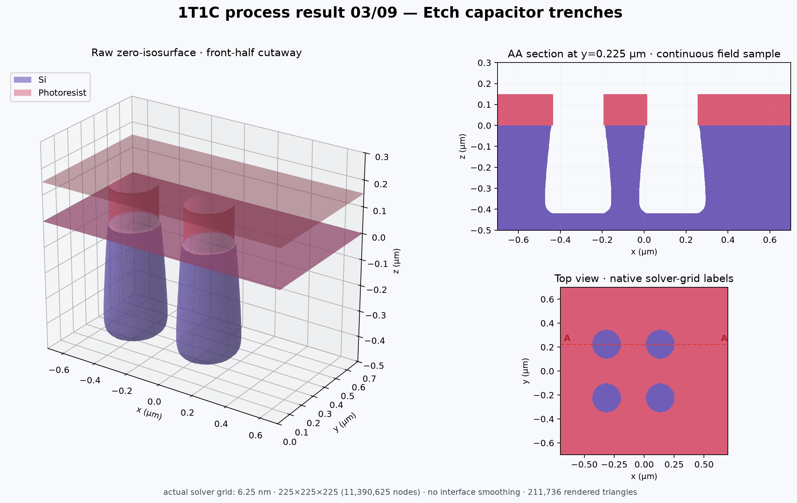

## 04 去胶

整片曝光，只有光刻胶有速率，其余材料全部作为停止层。实测残留为零，硅一个节点都没被动过。

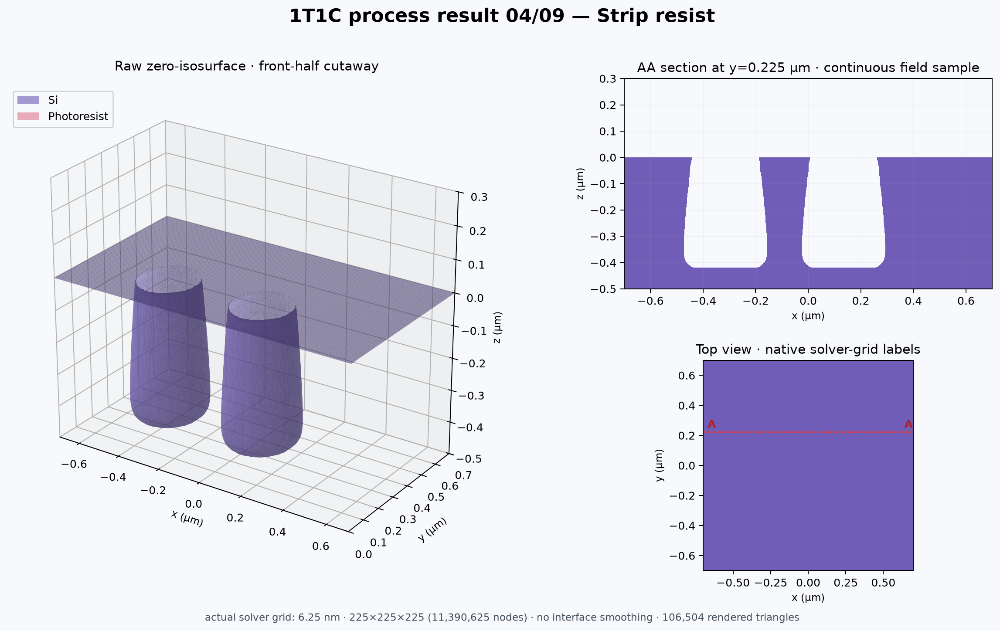

## 05 沉积电容介质

在所有与外部空气连通的 Si 表面进行 25 nm Al2O3 等厚几何沉积，包括沟槽侧壁和底部。远离开口的 37 列实测膜厚 25.0000 nm，极差为 0。

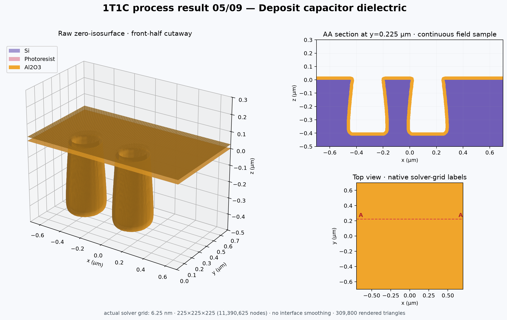

## 06 沉积下电极

在当前暴露表面继续沉积 25 nm TiN。旧材料界面保持不动，新材料按优先级覆盖显示。

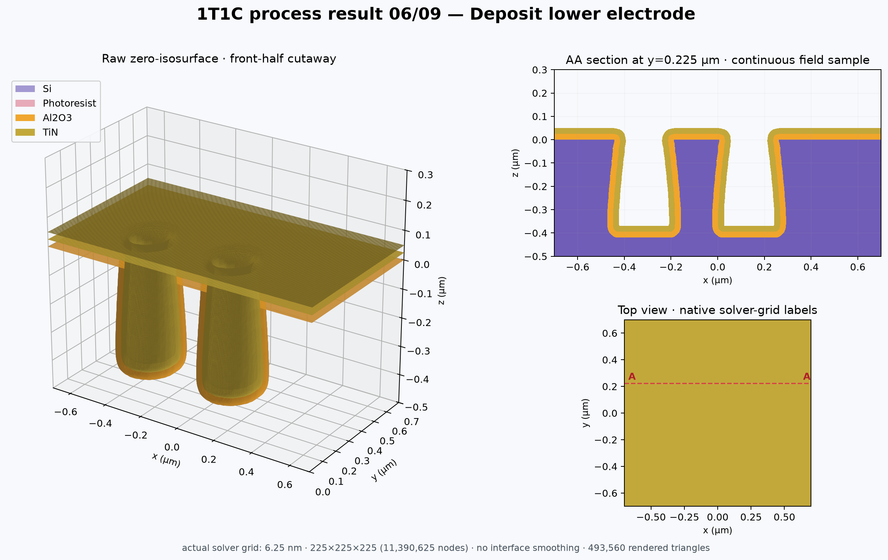

## 07 填充电容金属

以 85 nm W 保形沉积近似金属填充。当前模型允许沉积过程中发生 pinch-off，但尚未模拟同一步内封口后输运截止，因此图中保留的内部空隙需要被视作模型结果而不是自动修补对象。

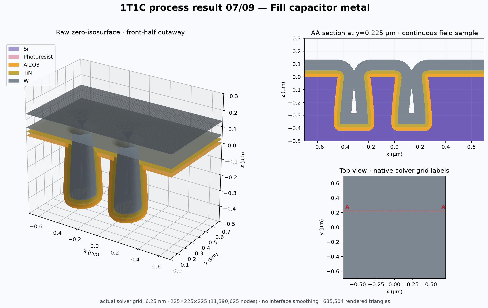

## 08 电容 CMP

把 Al2O3、TiN 和 W 在 z=0 µm 以上的部分移除，以 Si 作为停止层，得到平坦化后的电容顶部。

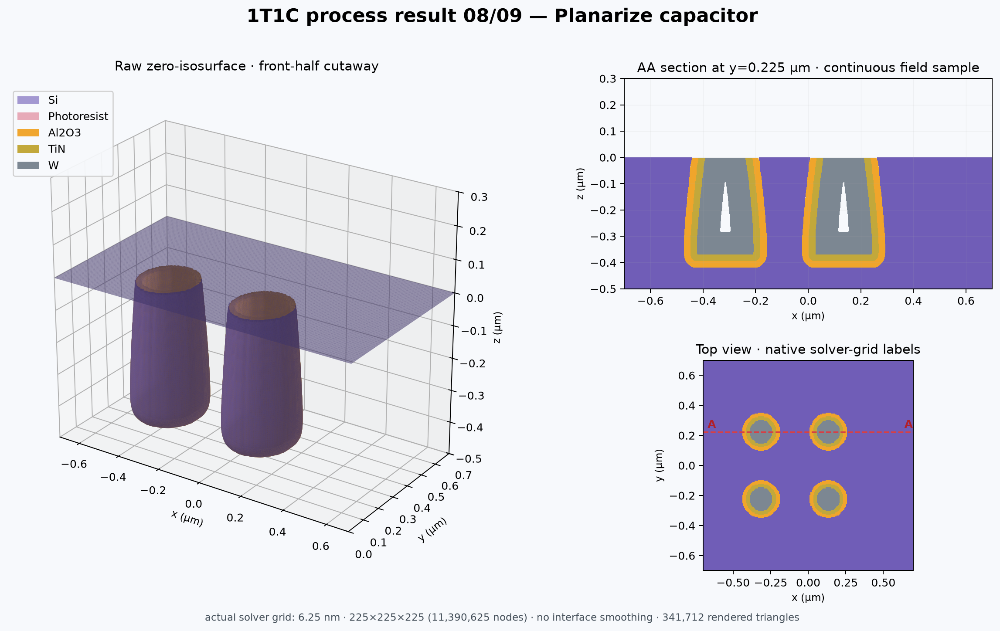

## 09 沉积层间介质

在平坦化结构上沉积 100 nm SiO2，形成后续垂直沟道和栅结构的层间介质。

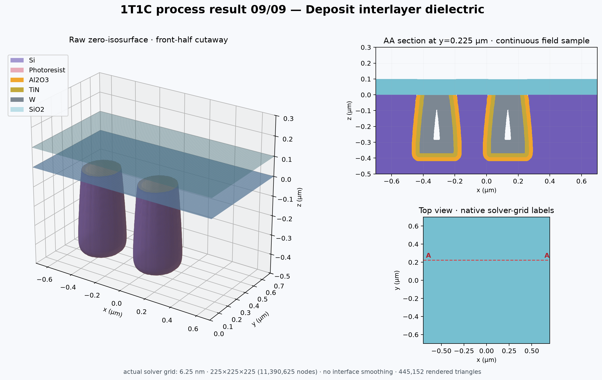

## 10 建立垂直沟道

使用 channel Quick Sketch 在指定区域放置 220 nm 高的 Si 方向性柱体。当前步骤是参数化几何构造，不包含真实外延生长动力学。

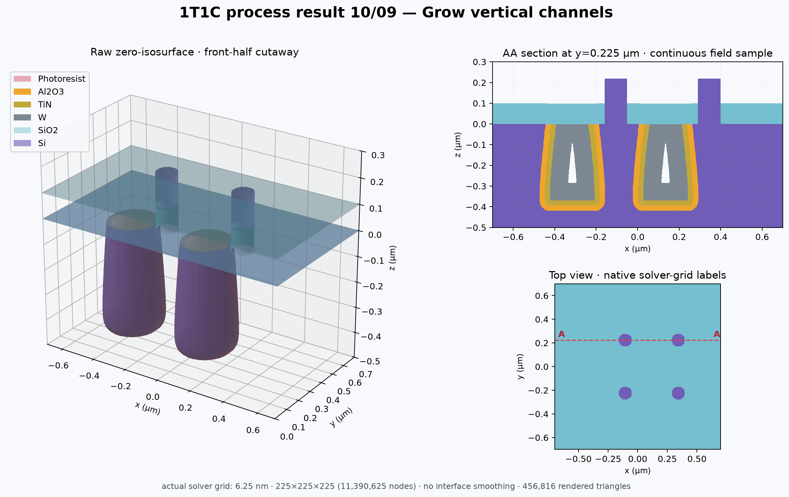

## 11 图形化栅介质

使用环形 Quick Sketch 放置 130 nm 高的 Al2O3 栅介质柱体，基准高度为 z=0.045 µm。当前步骤同样是几何构造，不是 ALD 输运模型。

## 12 图形化 TiN 字线

使用 gate Quick Sketch 放置 75 nm 高的 TiN 结构，基准高度为 z=0.075 µm，完成当前 2×2 1T1C 示范结构。

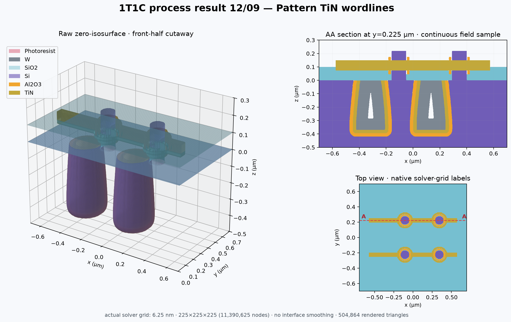

## 数值检查

| 项目 | 实测 |
| --- | --- |
| 平坦区 Al2O3 膜厚 | 25.0000 nm，极差 0 |
| 沟槽侧壁与底部膜厚 | 25.00 nm |
| 下方为空的界面节点 | 0 |
| 去胶残留 | 0 |
| 沟槽左右半宽差 | −0.84 nm（12.5 nm 网格上为 −3.05 nm） |

沟槽的左右半宽差是采样相位误差：掩膜圆心落在节点上或两节点正中时精确为零，落在其他相位时最大约三分之一个网格，随网格加密按 h 收敛。阵列节距是网格间距的整数倍，所以四个单元的相位相同，误差也一模一样。原始数字见 [`assets/1t1c-steps/numerical-verification.json`](assets/1t1c-steps/numerical-verification.json)。
